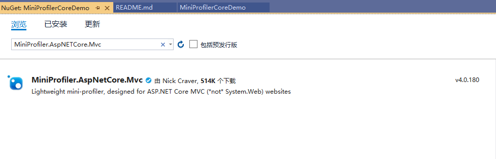
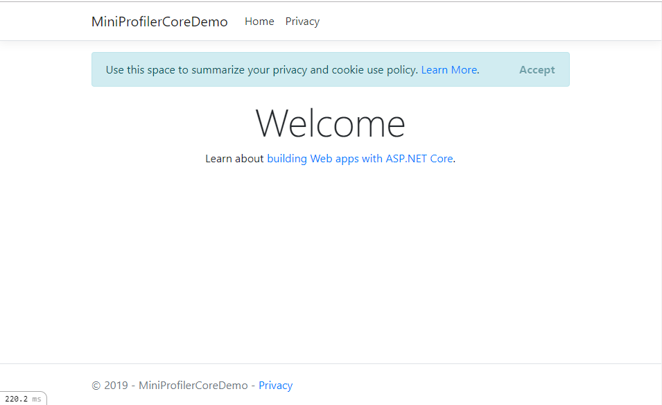
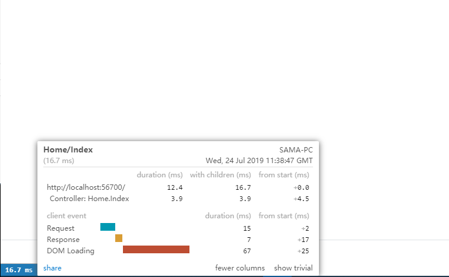
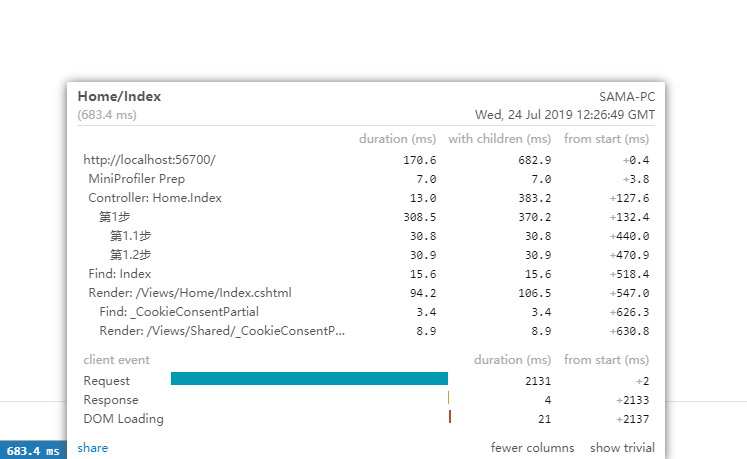
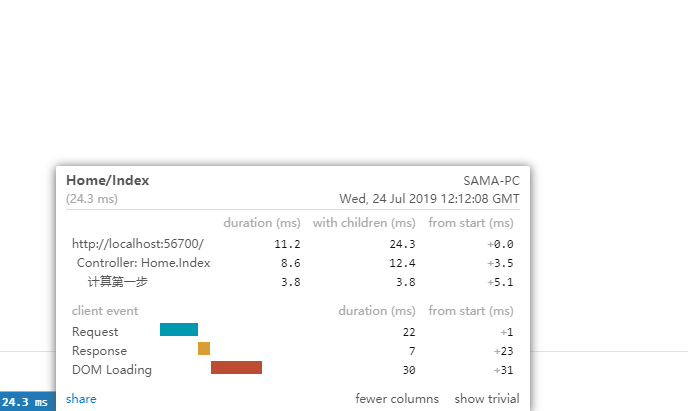
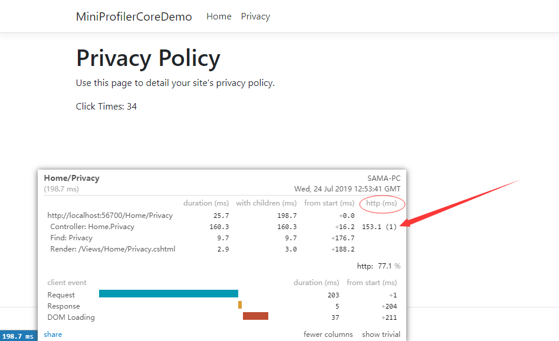
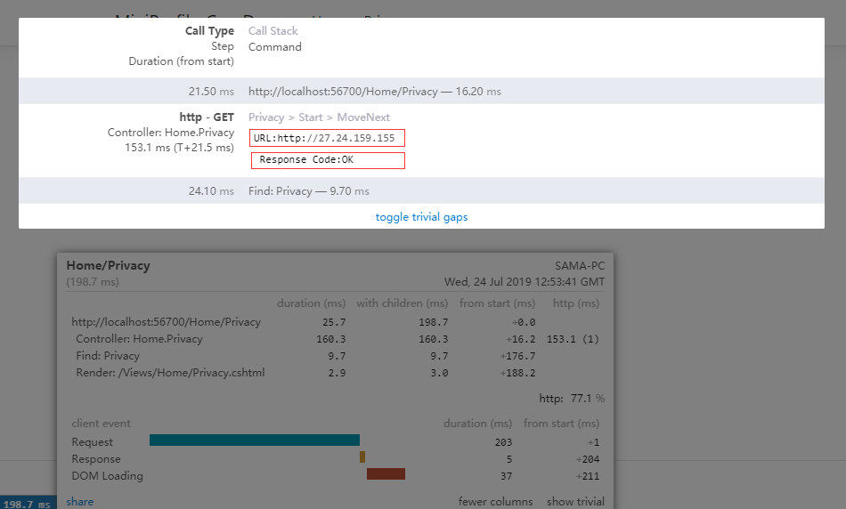

# 使用 MiniProfiler 来分析 ASP.NET Core 应用

 MiniProfiler（[https://miniprofiler.com/](https://miniprofiler.com/)）是一个轻量级且简单易用的分析工具库，它可以用来分析ASP.NET Core应用。

## 优点

针对ASP.NET Core MVC应用，使用MiniProfiler的优点是：它会把结果直接放在页面的左下角，随时可以点击查看；这样的话就可以感知出你的程序运行的怎么样；同时这也意味着，在你开发新功能的同时，可以很快速的得到反馈。


## 一、安装配置MiniProfiler

在现有的ASP.NET Core MVC项目里，通过Nuget安装MiniProfiler ：

`Install-Package MiniProfiler.AspNetCore.Mvc`

当然也可以通过`Nuget Package Manager`可视化工具安装



接下来配置MiniProfiler，总共分三步：

#### 第一步，来到`Startup.cs`的`ConfigureServices`方法里，添加`services.AddMiniProfiler();`

```csharp
    // This method gets called by the runtime. Use this method to add services to the container.
    public void ConfigureServices(IServiceCollection services)
    {
        services.Configure<CookiePolicyOptions>(options =>
        {
            // This lambda determines whether user consent for non-essential cookies is needed for a given request.
            options.CheckConsentNeeded = context => true;
            options.MinimumSameSitePolicy = SameSiteMode.None;
        });


        services.AddMvc().SetCompatibilityVersion(CompatibilityVersion.Version_2_2);

        // 当然这个方法还可以添加一个lambda表达式作为参数，从而做一些自定义的配置：
        services.AddMiniProfiler(options =>
        {
            // 设定弹出窗口的位置是左下角
            options.PopupRenderPosition = RenderPosition.BottomLeft;
            // 设定在弹出的明细窗口里会显式Time With Children这列
            options.PopupShowTimeWithChildren = true;
        });
    }
```

#### 第二步，来到来到`Startup.cs`的`Configure`方法里，添加`app.UseMiniProfiler();`

```csharp
    // This method gets called by the runtime. Use this method to configure the HTTP request pipeline.
    public void Configure(IApplicationBuilder app, IHostingEnvironment env)
    {
        ...

        // 最重要的一点是就是配置中间件在管道中的位置，一定要把它放在UseMvc()方法之前。 
        app.UseMiniProfiler();

        app.UseMvc(routes =>
        {
            routes.MapRoute(
                name: "default",
                template: "{controller=Home}/{action=Index}/{id?}");
        });
    }
```

#### 第三步，将`MiniProfiler`的`Tag Helper`放到页面上

* _ViewImports 页面引入 MiniProfiler 的 Tag Helper ：

```csharp
    ...

    @using StackExchange.Profiling

    ...
    @addTagHelper *, MiniProfiler.AspNetCore.Mvc
```

* 将 MiniProfiler 的Tag Helper 放入 _Layout.cshtml 中：

```csharp
    ...

    <footer class="border-top footer text-muted">
        <div class="container">
            &copy; 2019 - MiniProfilerCoreDemo - <a asp-area="" asp-controller="Home" asp-action="Privacy">Privacy</a>
        </div>
    </footer>

    @* 其实放在页面的任意地方都应该可以，但是由于它会加载一些脚本文件，所以建议放在footer下面： *@@* 其实放在页面的任意地方都应该可以，但是由于它会加载一些脚本文件，所以建议放在footer下面： *@
    <mini-profiler />

    <environment include="Development">
        <script src="~/lib/jquery/dist/jquery.js"></script>
        <script src="~/lib/bootstrap/dist/js/bootstrap.bundle.js"></script>
    </environment>

    ...

    @RenderSection("Scripts", required: false)
</body>
</html>

```

 运行应用，可以看到左下角就是MiniProfiler：



 点击它之后会弹出窗口，里面有每个步骤具体的耗用时间。




## 二、MiniProfiler 具体使用

#### 分析局部代码

前面的例子里，我们使用`MiniProfiler`分析了页面整个流程的时间。而`MiniProfiler`也可以用来分析一段代码所耗用的时间。看例子：

```csharp
    public async Task<IActionResult> Index()
    {
#if !DEBUG
        // 这里我们使用了using语句，里面使用了 MiniProfiler 类的 Current 属性，在该属性上面有一个Step()方法，
        // 它可以用来分析using语句里面的代码，在Step方法里，要提供一个具有描述性的名称来表示该段代码做的是什么动作，这个名称会显示在结果里。
        using (MiniProfiler.Current.Step("计算第一步"))
        {
            var users = await _context.Users.ToListAsync();
            return View(users);
        }
#else
        // 通常，我会使用 using 语句块来嵌套着使用

        using(MiniProfiler.Current.Step("第1步"))
        {

            // ... 相关操作
            Thread.Sleep(30);

            using(MiniProfiler.Current.Step("第1.1步"))
            {
                // ... 相关操作
                Thread.Sleep(30);
            }

            using(MiniProfiler.Current.Step("第1.2步"))
            {
                // ... 相关操作
                Thread.Sleep(30);
            }
       }

        // 但是如果你只想分析一句话，那么使用using语句就显得太麻烦了，这种情况下可以使用 Inline() 方法：
        var users = await MiniProfiler.Current.Inline(async () => await _context.Users.ToListAsync(), "计算第一步");
        return View(users);
#endif
    }
```

* 使用 using 语句块嵌套结果展示：


* 使用 Inline() 方法结果展示：


#### 自定义分析 CustomTiming

 有时候，分析一些例如请求外部动作的时候，上面讲的做法可能不太灵光，这里我们就可以使用`CustomTime()`方法

```csharp
    public async Task<IActionResult> Privacy()
    {
        // 这个例子里，我们使用 MiniProfiler.Current.CustomTiming() 方法。
        //  第一个参数是一个用于分类的字符串，这里我用的是http请求，所以写了http；
        //  第二个参数是命令字符串，这里我用不上，暂时留空；
        //  第三个参数是执行类型，这里我用的是Get请求，所以写了GET；
        using (CustomTiming timing = MiniProfiler.Current.CustomTiming("http", string.Empty, "GET"))
        {
            var url = "http://27.24.159.155";
            var httpClient = new HttpClient
            {
                BaseAddress = new Uri(url)
            };
            httpClient.DefaultRequestHeaders.Clear();
            httpClient.DefaultRequestHeaders.Accept.Add(new MediaTypeWithQualityHeaderValue("application/json"));

            var response = await httpClient.GetAsync("/system/resource/code/news/click/dynclicks.jsp?clickid=1478&owner=1220352265&clicktype=wbnews");

            timing.CommandString = $"URL:{url}\n\r Response Code:{response.StatusCode}";

            if (!response.IsSuccessStatusCode)
            {
                throw new Exception("Error fetching data from API");
            }

            var clickTimes = await response.Content.ReadAsStringAsync();

            ViewData["clickTimes"] = clickTimes;
        }

        return View();
    }
```

* 运行程序，可以看到窗口的右侧出现了`http`这一列：
 


* 点击 http 所在列的`153.1 (1)`，这就是使用CustomTiming分析的那段代码，它请求的URL和返回码都显示了出来。




## 三、在WebApi项目里使用MiniProfiler

#####  关于在WebApi项目里使用MiniProfiler的教程，请移步：[WEBAPI.md](./WEBAPI.md)


## 四、案例源码：
##### [MiniProfilerCoreDemo](https://github.com/Run2948/MiniProfilerCoreDemo)
