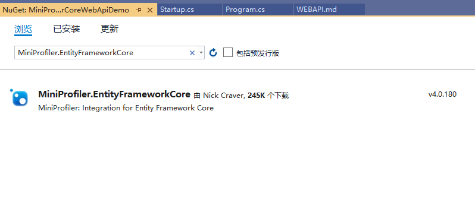

# 在WebApi项目里使用MiniProfiler并且分析 Entity Framework Core

## 一、安装配置MiniProfiler

在现有的ASP.NET Core MVC WebApi 项目里，通过Nuget安装`MiniProfiler`：

`Install-Package MiniProfiler.AspNetCore.Mvc MiniProfiler.EntityFrameworkCore`

当然也可以通过`Nuget Package Manager`可视化工具安装



接下来就是如何配置和使用 MiniProfiler 了，总共分三步：

#### 第一步，来到`Startup.cs`的`ConfigureServices`方法里，添加`services.AddMiniProfiler();`

```csharp
    // This method gets called by the runtime. Use this method to add services to the container.
    public void ConfigureServices(IServiceCollection services)
    {
        services.AddDbContext<DataContext>(options => options.UseSqlServer(Configuration.GetConnectionString("DataContext")));

        services.AddMvc().SetCompatibilityVersion(CompatibilityVersion.Version_2_2);

        // 首先添加一个配置选项，用于访问分析结果：
        services.AddMiniProfiler(options =>
        {
            // 设定弹出窗口的位置是左下角
            options.PopupRenderPosition = RenderPosition.BottomLeft;
            // 设定在弹出的明细窗口里会显式Time With Children这列
            options.PopupShowTimeWithChildren = true;
            // 设定访问分析结果URL的路由基地址
            options.RouteBasePath = "/profiler";
        })
        // 然后在之前的配置后边加上AddEntityFramework()：
        .AddEntityFramework();
    }
```

#### 第二步，来到来到`Startup.cs`的`Configure`方法里，添加`app.UseMiniProfiler();`

```csharp
    // This method gets called by the runtime. Use this method to configure the HTTP request pipeline.
    public void Configure(IApplicationBuilder app, IHostingEnvironment env)
    {
        ...

        // 最重要的一点是就是配置中间件在管道中的位置，一定要把它放在UseMvc()方法之前。 
        app.UseMiniProfiler();

        app.UseMvc();
    }
```

#### 第三步、运行程序，一共有3个可查看分析结果相关的URL地址：

####  1.`/profiler/results-index`

* 先看results-index页面： 


> 它表示每次调用API的记录结果。可以看到本次调用API的总时间为1578.4毫秒。

####  2.`/profiler/results` 

* 从result-index页面点击链接进入这次API调用的详细结果页面，也就是result页面：


> 它表示每次调用API的过程分析结果，具体到每一条SQL语句的内容和执行时间。

####  3.`/profiler/results-list`

* 再看result-list页面：


> 它其实就表示每个API的所有调用记录结果的集合。

## 三、案例源码：
##### [MiniProfilerCoreWebApiDemo](https://github.com/Run2948/MiniProfilerCoreDemo/tree/master/MiniProfilerCoreWebApiDemo)
